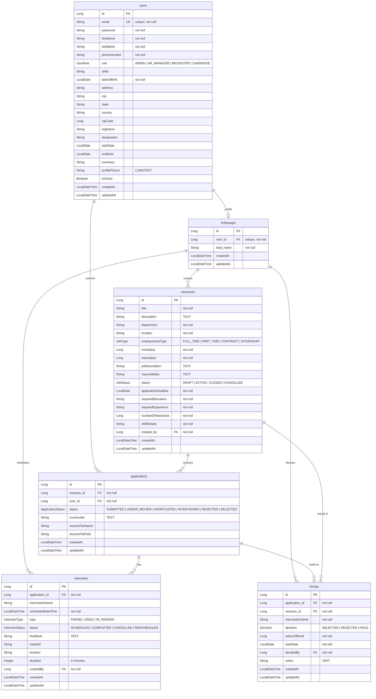

# 🏢 HireHub — Web Recruitment System

A full-stack web-based recruitment management platform that streamlines the entire hiring lifecycle — from posting vacancies, accepting applications, scheduling interviews, to making final hiring decisions.

Built with **Spring Boot 3** (backend) and **React + Vite** (frontend).

---

## 📑 Table of Contents

- [Features](#-features)
- [Tech Stack](#-tech-stack)
- [Architecture](#-architecture)
- [Database Schema (ER Diagram)](#-database-schema-er-diagram)
- [Project Structure](#-project-structure)
- [Getting Started](#-getting-started)
- [API Endpoints](#-api-endpoints)
- [User Roles & Permissions](#-user-roles--permissions)
- [Screenshots](#-screenshots)
- [Contributing](#-contributing)
- [License](#-license)

---

## ✨ Features

### 👤 For Applicants (Job Seekers)
- **Sign Up / Sign In** with secure JWT-based authentication
- **Browse & Search** active job vacancies
- **Apply for Jobs** with cover letter and resume upload
- **Track Applications** — view status updates in real time (Submitted → Under Review → Shortlisted → Interviewed → Selected/Rejected)
- **View Interview Schedules** — see upcoming interviews with date, time, type, and meet link
- **Profile Management** — update personal details, skills, experience, and profile picture
- **Dashboard** — at-a-glance stats of applications, interviews, and outcomes

### 🧑‍💼 For HR Managers
- **Dashboard** — key metrics and recruitment analytics at a glance
- **Vacancy Management** — create, edit, and manage job postings with full details (salary range, department, shift, education requirements, etc.)
- **Applicant Tracking** — review incoming applications, update statuses, shortlist candidates
- **Interview Scheduling** — schedule phone, video, or in-person interviews; assign meet URLs; track interview status
- **Hiring Decisions** — record final decisions (Selected / Rejected / Hold) with salary offers and notes
- **Reports** — visual recruitment analytics with charts (powered by Recharts)
- **Settings** — account and preference management

---

## 🛠 Tech Stack

### Backend
| Technology | Purpose |
|---|---|
| **Java 21** | Programming language |
| **Spring Boot 3.5** | REST API framework |
| **Spring Security** | Authentication & authorization |
| **JWT (jjwt 0.11.5)** | Stateless token-based auth |
| **Spring Data JPA / Hibernate** | ORM & database access |
| **MySQL** | Relational database |
| **Lombok** | Boilerplate reduction |
| **ModelMapper** | DTO ↔ Entity mapping |
| **SpringDoc OpenAPI** | Swagger UI for API docs |
| **BCrypt** | Password hashing |

### Frontend
| Technology | Purpose |
|---|---|
| **React 18** | UI library |
| **Vite 5** | Build tool & dev server |
| **React Router v7** | Client-side routing |
| **Axios** | HTTP client for API calls |
| **Tailwind CSS 3** | Utility-first CSS framework |
| **Recharts** | Data visualization / charts |
| **Lucide React** | Icon library |
| **React Toastify** | Toast notifications |

---

## 🏗 Architecture

```
┌─────────────────────┐         ┌─────────────────────────┐
│                     │  HTTP   │                         │
│   React Frontend    │◄───────►│  Spring Boot Backend    │
│   (Vite, Port 5173) │  REST   │  (Port 8080)            │
│                     │  + JWT  │                         │
└─────────────────────┘         └────────┬────────────────┘
                                         │
                                         │ JPA / Hibernate
                                         ▼
                                ┌─────────────────────┐
                                │      MySQL DB       │
                                │ web_recruitment_    │
                                │ system              │
                                └─────────────────────┘
```

- **Stateless REST API** — no server-side sessions; JWT tokens for every authenticated request
- **Role-based access control** — endpoints secured by `ROLE_USER` and `ROLE_HRMANAGER`
- **CORS configured** — allows frontend dev server origins

---

## 📊 Database Schema (ER Diagram)



---

## 📂 Project Structure

```
Web-Recruitment-System/
├── BackEnd/
│   └── spring_boot_backend_template/
│       ├── pom.xml
│       └── src/main/java/com/sunbeam/
│           ├── Application.java              # Spring Boot entry point
│           ├── controller/
│           │   ├── AuthController.java        # Sign in / Sign up
│           │   ├── VacancyController.java     # CRUD for vacancies
│           │   ├── ApplicationController.java # Job applications
│           │   ├── InterviewController.java   # Interview scheduling
│           │   ├── HiringController.java      # Hiring decisions
│           │   └── DashboardController.java   # Stats & analytics
│           ├── service/                       # Business logic layer
│           ├── dao/                           # JPA repositories
│           ├── dto/                           # Data Transfer Objects
│           ├── entity/                        # JPA entities
│           │   ├── BaseEntity.java            # id, createdAt, updatedAt
│           │   ├── User.java
│           │   ├── HrManager.java
│           │   ├── Vacancy.java
│           │   ├── Application.java
│           │   ├── Interview.java
│           │   ├── Hirings.java
│           │   └── types/                     # Enums (UserRole, JobStatus, etc.)
│           ├── security/
│           │   ├── SecurityConfig.java        # CORS, role-based access
│           │   ├── JwtFilter.java             # JWT token filter
│           │   └── JwtUtil.java               # Token generation & validation
│           ├── custom_exceptions/             # Custom exception classes
│           └── exception_handler/             # Global exception handler
│
├── FrontEnd/
│   ├── package.json
│   ├── vite.config.js
│   ├── tailwind.config.js
│   ├── index.html
│   └── src/
│       ├── App.jsx                            # Routes & auth context
│       ├── main.jsx                           # Entry point
│       ├── index.css                          # Global styles
│       ├── config.js                          # API base URL config
│       ├── services/
│       │   ├── auth.js                        # Auth API calls
│       │   ├── hr.js                          # HR API calls
│       │   └── applicant.js                   # Applicant API calls
│       └── components/
│           ├── LandingPage.jsx                # Public landing page
│           ├── SignIn.jsx                      # Login form
│           ├── SignUp.jsx                      # Registration form
│           ├── hr/                            # HR Manager portal
│           │   ├── Layout.jsx                 # Sidebar + header layout
│           │   ├── HRDashboard.jsx            # Dashboard with stats
│           │   ├── Vacancies.jsx              # Vacancy listing
│           │   ├── CreateVacancy.jsx           # Create new vacancy
│           │   ├── EditVacancy.jsx             # Edit existing vacancy
│           │   ├── VacancyCard.jsx             # Vacancy display card
│           │   ├── Applicants.jsx             # Applicant management
│           │   ├── Interviews.jsx             # Interview scheduling
│           │   ├── HRHirings.jsx              # Hiring decisions
│           │   ├── HRReports.jsx              # Reports & charts
│           │   └── Settings.jsx               # HR settings
│           └── applicants/                    # Applicant portal
│               ├── ApplicantLayout.jsx        # Layout wrapper
│               ├── ApplicantNavbar.jsx        # Navigation bar
│               ├── ApplicantDashboard.jsx     # Dashboard
│               ├── ApplicantProfile.jsx       # Profile management
│               ├── JobListings.jsx            # Browse & apply for jobs
│               ├── MyApplications.jsx         # Track applications
│               ├── MyInterviews.jsx           # View interview schedule
│               └── ApplicantSettings.jsx      # Settings
│
└── README.md
```

---

## 🚀 Getting Started

### Prerequisites

- **Java 21** (JDK)
- **Maven 3.8+**
- **Node.js 18+** and **npm**
- **MySQL 8.0+**

### 1. Clone the Repository

```bash
git clone https://github.com/hiteshkumarrdrajpurohit/Web-Recruitment-System.git
cd Web-Recruitment-System
```

### 2. Set Up the Database

Create a MySQL database (or let the app auto-create it):

```sql
CREATE DATABASE web_recruitment_system;
```

Update credentials in `BackEnd/spring_boot_backend_template/src/main/resources/application.properties`:

```properties
spring.datasource.url=jdbc:mysql://localhost:3306/web_recruitment_system
spring.datasource.username=YOUR_USERNAME
spring.datasource.password=YOUR_PASSWORD
```

### 3. Start the Backend

```bash
cd BackEnd/spring_boot_backend_template
mvn spring-boot:run
```

The API server starts at **http://localhost:8080**.

> **Swagger UI** is available at: [http://localhost:8080/swagger-ui.html](http://localhost:8080/swagger-ui.html)

### 4. Start the Frontend

```bash
cd FrontEnd
npm install
npm run dev
```

The frontend dev server starts at **http://localhost:5173**.

### 5. Open the App

Navigate to [http://localhost:5173](http://localhost:5173) in your browser. You'll see the landing page where you can sign up as a new user or sign in.

---

## 🔗 API Endpoints

### Authentication
| Method | Endpoint | Access | Description |
|--------|----------|--------|-------------|
| `POST` | `/users/signup` | Public | Register a new user |
| `POST` | `/users/signin` | Public | Login and receive JWT |

### User / Profile
| Method | Endpoint | Access | Description |
|--------|----------|--------|-------------|
| `GET` | `/users/profile` | USER | Get current user profile |
| `PUT` | `/users/update` | USER | Update profile details |
| `GET` | `/users/candidates` | HRMANAGER, USER | List all candidates |

### Vacancies
| Method | Endpoint | Access | Description |
|--------|----------|--------|-------------|
| `GET` | `/vacancies` | Public | List active vacancies |
| `GET` | `/vacancies/{id}` | Public | Get vacancy details |
| `GET` | `/vacancies/all` | HRMANAGER | List all vacancies (incl. draft/closed) |
| `POST` | `/vacancies` | HRMANAGER | Create a new vacancy |
| `PUT` | `/vacancies/{id}` | HRMANAGER | Update a vacancy |
| `DELETE` | `/vacancies/{id}` | HRMANAGER | Delete a vacancy |

### Applications
| Method | Endpoint | Access | Description |
|--------|----------|--------|-------------|
| `POST` | `/applications/apply` | USER | Apply for a vacancy |
| `GET` | `/applications/my` | USER | Get user's applications |
| `GET` | `/applications/check-applied/{vacancyId}` | USER | Check if already applied |
| `GET` | `/applications` | HRMANAGER | List all applications |
| `PUT` | `/applications/{id}` | HRMANAGER | Update application status |

### Interviews
| Method | Endpoint | Access | Description |
|--------|----------|--------|-------------|
| `GET` | `/interviews/application/{appId}` | HRMANAGER, USER | Get interviews for an application |
| `POST` | `/interviews` | HRMANAGER | Schedule an interview |
| `PUT` | `/interviews/{id}` | HRMANAGER | Update interview details |
| `DELETE` | `/interviews/{id}` | HRMANAGER | Cancel an interview |

### Hirings
| Method | Endpoint | Access | Description |
|--------|----------|--------|-------------|
| `GET` | `/hirings` | HRMANAGER | List all hiring records |
| `POST` | `/hirings` | HRMANAGER | Record a hiring decision |

### Dashboard
| Method | Endpoint | Access | Description |
|--------|----------|--------|-------------|
| `GET` | `/dashboard/hr/**` | HRMANAGER | HR dashboard statistics |
| `GET` | `/dashboard/applicant/**` | USER | Applicant dashboard stats |

---

## 🔐 User Roles & Permissions

| Role | Code | Access |
|------|------|--------|
| **Applicant** | `ROLE_USER` | Browse jobs, apply, track applications, view interviews, manage profile |
| **HR Manager** | `ROLE_HRMANAGER` | Full recruitment lifecycle — vacancies, applicants, interviews, hirings, reports |

> Authentication uses **JWT Bearer tokens**. Include the token in the `Authorization` header:
> ```
> Authorization: Bearer <your_jwt_token>
> ```

---

## 🖼 Screenshots

> 


## Applicant


## HR Manager


---

## 🤝 Contributing

1. Fork the repository
2. Create a feature branch: `git checkout -b feature/your-feature`
3. Commit your changes: `git commit -m "Add your feature"`
4. Push to the branch: `git push origin feature/your-feature`
5. Open a Pull Request

---

## 📄 License

This project is for educational/academic purposes. Feel free to use and modify.

---

<p align="center">
  Built with ❤️ using Spring Boot & React
</p>


